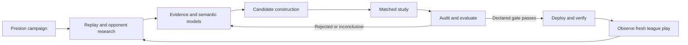

# Preston autoresearch parity

Research date: 2026-10-06. The research and gap analysis below describe the starting state. The final delivery section records the implemented capabilities and their validation limits.

## Finding

The reference session succeeded because it combined scientific investigation with a reproducible execution system: inspect real play, identify a mechanism, change a specific policy, compare it with the incumbent under matched conditions, preserve adverse evidence, recover from infrastructure failures, and deploy the exact tested source.

The IDE has useful durable session infrastructure, but its experiment path cannot perform that loop. Improving prompts or lifting the budget will not remove its one-game constraint. The central change should be a persistent research campaign coordinating specialized sessions and deterministic evaluation jobs.

## Evidence reviewed

- [Session context](../../polyworld/GOTA_SESSION_CONTEXT.md)
- [Readable transcript](../../polyworld/GOTA_SESSION_TRANSCRIPT.md) and [199-record JSONL transcript](../../polyworld/GOTA_SESSION_TRANSCRIPT.jsonl)
- [Final study report](../../polyworld-gota-autoresearch-20261005/research/combined-positive/README.md), protocol, runner, supervisor, promotion code, completion and validation records
- Harness task orchestration, hosted request construction, semantic models, task constraints, and submission tooling

The transcript omits tool calls/results and runtime records. I therefore inspected the linked study artifacts and implementation as well. The final candidate's local bytes match its recorded SHA-256, and completion and deployment records agree on both deployed version IDs. I have not independently rerun the replay audits, checked today's live membership, or repeated any paid games. Deployment and ranking statements below describe the historical records.

## What the reference demonstrates

The final study combined two unchanged components: poison deferral when an already committed spell was predicted lethal, and lower-HP eligible guard targeting. It tested 128 fresh matched configurations, producing 256 completed hosted games. Each pair held seed, map, configuration and the other nine policies fixed. All ten policies reacted normally; recorded opponent commands were not used to estimate competitive results.

| Measure | Baseline → candidate |
| --- | --- |
| Wins | 55 → 59 |
| Losses | 4 → 4 |
| Draws | 69 → 65 |
| Mean XP | +106.05 per game |
| Mean match utility | +1.5625 percentage points |
| 95% paired utility interval | −1.5625 to +4.6875 percentage points |

This is directional improvement, not statistically established superiority. A positive-result deployment rule was recorded before outcomes and passed. Both owned players received the tested source, with rollback records and membership readbacks. Their immediately observed leaderboard positions accumulated under earlier policies and do not prove the new deployment improved ranking.

The runner accounted for 26 additional transport-failure attempts without discarding scored outcomes or creating duplicate completed games. The broader campaign recorded 958 completed hosted games. These are useful reliability targets, not a requirement to run hundreds of games for every hypothesis.

Several earlier candidates increased XP while losing wins. A hero-burst candidate improved its development sample but regressed on fresh confirmation. A correct poison saving also changed a win into a draw. Preston needs to retain all of these distinctions: a plausible mechanism, a passing runtime check, a better proxy score and a competitive improvement are different claims.

## Current parity gaps

| Capability | Existing foundation | Missing behavior |
| --- | --- | --- |
| Persistent work | Durable tasks, checkpoints, dispatcher, workers, logs, stable session URLs | A campaign that continues across investigations, studies, failures and deployments |
| Competitive evaluation | Hosted request and result reconciliation | Matched baseline/candidate studies with fixed rosters, seeds, configurations and multiple games |
| Replay investigation | Episode statistics, replay UI, opponent snapshots | Worker-accessible tick/event extraction, versioned replay audit, mechanism instrumentation and counterexample search |
| Candidate development | Semantic single-span patch, proposal comparison, source limits | Isolated multi-component candidates, compatibility checks and independent promotion of a tested candidate |
| Shared learning | Partner claims, opponent semantic IR, stored worker outputs | Searchable typed artifacts with exact provenance, lineage, contradictions and fixture-consumption history |
| Autonomous promotion | Upload and league submission helpers | Standing scoped authority, exact tested-source checks, incumbent checks, rollback receipts and verified per-player activation |
| Recovery | Task leases, retries, generation fencing | Attempt-level reconciliation and infrastructure backoff across a study without rerolling outcomes |

Specific blockers:

- [Task router](../agent/subagents/task_router/instructions.md) explicitly limits experiments to one self-play game and rejects repeated experiments, larger validation and automatic entry.
- [Hosted request](../lib/softmax.ts) constructs ten seats of the same policy and `num_episodes: 1`. This tests execution, not improvement against the league's opposition.
- [Task operations](../agent/lib/tasks/operations.ts) associate one experiment with a task and supply only a small recent experiment sample to evaluation. [Database constraints](../supabase/migrations/0024_background_sessions.sql) enforce research with zero games or an experiment with one game.
- [Task workflow](../agent/tools/run_task.ts) ends after a research result or a single candidate evaluation. Failure to establish the requested target can become `needs_input` instead of another investigation.
- [Reviewer instructions](../agent/subagents/task_reviewer/instructions.md) correctly reject unsupported self-play conclusions but also prohibit autonomous submission. [Entry tooling](../agent/tools/enter_league.ts) still requires approval every time, despite the user's standing authorization.
- [Opponent IR](../lib/opponents/semantic-model.ts) already distinguishes observations from hypotheses and requires evidence. Its references need finer granularity than an episode ID and prose detail for reproducible mechanism claims.

Tracking-only dollar budgets are already implemented. Model-call, game-count and deadline limits are separate constraints; removing dollar enforcement does not make this runner an open-ended campaign.

## Proposed execution model

Preston owns a **campaign**: improve the selected player's standing in the selected league. A campaign persists beyond chat or voice connections. It creates specialized **sessions** for opponent analysis, replay mining, policy construction, evaluation and synthesis. A **study** is the reproducible comparison owned by an evaluation session. **Artifacts** are the shared products that subsequent sessions consume.

The LLM selects investigations and interprets evidence. Deterministic workers handle game submission, polling, retries, accounting, statistical calculation and deployment reconciliation. Waiting for 256 games should not consume 256 model conversations.

Use the current Eve/task infrastructure first. The reference supervisor's local processes and JSON checkpoints provide valuable logic, but are not themselves a production multi-user orchestration service. A workflow engine migration is not the first dependency.

### Shared records

| Record | Required identity and content |
| --- | --- |
| Campaign | Owner, league/player IDs, objective, ranking metric, standing permissions, lifecycle, cost/usage, next action |
| Session | Intent, goal, parent, role, exact inputs, output artifact IDs, full tool/message log, status, checkpoint, costs and failure reason |
| Evidence | Episode/artifact hash, game release, policy versions, actor/seat, tick range, event/state/action, extraction method, observation versus inference |
| Opponent model | Player and policy version, evidence-linked behavior hypotheses, counterexamples, unknowns, applicability and update history |
| Candidate | Baseline source hash, isolated source, component/patch IDs, semantic contracts, compatibility results, lineage |
| Study | Frozen candidate/baseline hashes, metric and decision rule, sample plan, fixtures, arms, attempts, results, audits, uncertainty, consumed-fixture registry |
| Deployment | Target player, expected incumbent, tested hash, uploaded version, before/after membership, rollback version, per-player outcome |

Store task state and searchable metadata in the database; policy source, semantic models and small manifests in a versioned workspace; replays and large logs in artifact storage. Link everything by immutable IDs and hashes. A Git repository is valuable continuity, but should not be the queue or the sole searchable record of execution.

Every session should publish a compact result envelope: what it attempted, what it produced, what it found, what it could not establish, and artifact references. Preston retrieves relevant evidence rather than stuffing every historical transcript into each prompt.

### Learning and evaluation rules

- Resolve the current league metric before choosing a proxy. For the recorded GoTA release, win/draw/loss utility is closer to the MMR objective than XP. Keep XP/Glory and economic indicators for diagnosis and inexpensive screening; do not promote an XP-only improvement that sacrifices wins.
- Freeze the candidate, sample and decision rule before seeing confirmation outcomes. Mark examined fixtures consumed. Fresh confirmation must not reuse development or previously examined confirmation fixtures after tuning.
- Keep actual opponents responding in competitive comparisons. Exact-prefix interventions are useful to establish a local mechanism, not a substitute for full-game outcomes.
- Allow batches of compatible changes. Record each component's contract and test the combined policy; individually promising components can interact badly.
- Preserve regression examples and failed hypotheses. Do not infer opponent intent as fact or equate resource conservation with better match outcomes.
- Treat infrastructure failures separately from policy/runtime failures. Retain every request and attempt; retry exact inputs only under explicit rules. Reconcile uncertain submission outcomes before creating another request.
- A game release change makes old evidence version-specific. Revalidate compatibility and create a new study rather than mixing engines in one comparison.
- Automatic deployment is authorized. Technical gates replace routine approval prompts: exact source identity, valid evidence, correct owner/player, unchanged incumbent and rollback records. A change to scope or authority is different from an ordinary test/deploy step.
- Do not hardcode the reference study's positive-XP gate or 128-pair sample as universal requirements. Faster wins can reduce farming XP. Each protocol must reflect the campaign objective and report uncertainty honestly.

### Multi-session coordination

Parallel research sessions can analyze separate opponents and publish models into the same scoped artifact collection. A synthesis session combines compatible findings and proposes candidate components with explicit evidence links. Candidate editing occurs in separate workspaces; a single promotion coordinator serializes changes to each live player and checks the expected incumbent.

This improves on holding a global policy writer throughout long hosted waits. The human draft, research candidates and deployed champion should be distinct identities. A candidate may fail without replacing the user's workspace policy.

Completion events should schedule synthesis or evaluation. New league evidence or a periodic trigger can wake the campaign with a deduplicated event. Pausing a campaign must prevent new submissions while continuing to reconcile already submitted jobs. Canceling a worker must not erase its evidence or leave unknown paid requests untracked.

## Implementation order and acceptance checks

### 1. Import the reference and bind the real baseline

Import historical sessions, studies, semantic findings, rejected changes and deployment receipts as linked, read-only artifacts. Resolve the selected league/player's current champion before new research; distinguish it from the latest local revision. Record the current game release, objective and standing authority.

**Pass:** Preston can identify the final study, explain why hero burst was rejected, retrieve its counterexamples, and distinguish historical deployment records from freshly verified live state. No old study restarts during import.

### 2. Build the reusable matched-study runner

Introduce study → fixture → arm → attempt records. Adapt the reference `freeze.py`, `eval.py` and validation contracts behind a worker adapter. Parameterize league, players, candidate, baseline, release, rosters, seeds and storage; remove hardcoded account IDs and local paths. Replace the one-game uniqueness/scope constraints for this new path while preserving legacy records.

**Pass:** A small real matched study completes both arms with identical fixtures except the intended subject policy. Restart after provider acceptance but before local receipt persistence without duplicating games. Simulated transport failures back off and resume; policy failures remain visible. Every attempt is accounted for.

### 3. Add replay evidence and audit workers

Expose version-pinned replay decoding, event extraction, reward/VM checks and mechanism investigations as typed worker tools. Reuse the reference audit code where applicable. The harness currently forbids local simulation: put any native re-execution capability in an explicitly configured research worker, rather than silently adding local simulation to the student app.

**Pass:** A session can recover the recorded poison-waste mechanism and its positive-damage counterexample with exact episode/tick references. The UI opens that evidence. Incompatible replay versions fail clearly; ordinary episode statistics are never labeled a replay audit.

### 4. Connect research, semantic models and candidate construction

Implement the opponent-group workflow: collect → model each opponent → synthesize behaviors → create an isolated candidate → screen → confirm on fresh fixtures. Support compatible component batches, rejected branches and shared negative evidence. Reserve confirmation fixtures before outcome inspection.

**Pass:** Multiple sessions contribute evidence to one candidate with source and semantic lineage. A rejected study produces useful saved findings and the next investigation without posting a task prompt into Preston's user chat. Tuning invalidates the previous confirmation claim.

### 5. Complete automatic promotion

Adapt the reference promotion checks into idempotent per-player deployment steps. Recheck canonical release and incumbent, upload the exact tested bytes, save rollback information, submit, and verify active champion membership. A deployment to two players needs explicit partial-success state and reconciliation; it is not an atomic operation.

**Pass:** A qualifying candidate deploys without routine user approval and records verified activation. An incumbent change prevents a stale overwrite. Retry after one player's activation resumes the remaining work without obscuring which player changed.

### 6. Close the persistent campaign loop and polish its UI

Have Preston choose another investigation from fresh league evidence after acceptance, rejection or inconclusive results. Add deduplicated completion/schedule triggers, campaign pause/resume and shared artifact retrieval. Keep daily cost accounting visible without making the dollar budget a stop condition under the user's current preference.

Use compact session views: objective/status, current action, progress, result, evidence and expandable tool I/O. Show study counts, uncertainty and deployment separately. Distinguish `waiting for host`, `auditing`, `rejected`, `deployed` and `needs a decision`; infrastructure waits should not masquerade as requests for human judgment. Surface material findings to Preston's voice/chat, not every polling event.

**Pass:** One user objective survives browser closure and a worker restart, completes research → matched evaluation → audited decision → authorized deployment when warranted → fresh observation. All child work remains accessible by URL. The chat stays available for conversation.

## First useful delivery

Deliver one end-to-end vertical slice before a visual workflow builder: **analyze a selected opponent group, construct a candidate from linked evidence, evaluate it against the incumbent under matched conditions, and publish an auditable decision**. Then attach promotion and repeat scheduling. The user should see real competitive evidence early, rather than more sessions that terminate at the current one-game limitation.

The compact session view is the presentation layer for this system. The main remaining work is the research execution and evidence model underneath it.

## Implemented delivery — October 6

The campaign path now has persistent root and child sessions, immutable shared artifacts, live champion/source binding, isolated component synthesis, frozen screening and confirmation cohorts, matched hosted requests, durable attempts and retries, native replay/VM audit integration, paired uncertainty estimates, verified per-player promotion, and recurring observation. The root session and evaluation sessions expose progress, attempts, receipts and searchable evidence. Task completion wakes the campaign; the Eve dispatcher continues work after browsers close.

Migrations `0030`–`0034` supply the campaign records, fixture/seed exclusions, leased writes, atomic pause/steer controls, completion events and artifact search. They are applied to the local configured database. Historical reference import saved 142 artifacts, 457 episode exclusions and 199 transcript messages; it did not restart prior work. An initial live baseline check resolved the default player's champion to `4d96c2ee-c631-4574-98a4-1340a311532c`, hash `acafbc16b734739ea9917a7894e9fea72965420fd0eff5ece858b2dbb15e6824` (60,643 bytes), verified against live membership and episode source identity. That champion changed externally later during testing; the code rejected the stale baseline instead of silently reusing it. Every new campaign resolves live membership again.

Start through Preston's `research_campaign` tool, live voice `start_session` with `autoresearch: true`, the new-session form (its router recognizes ongoing/multi-game research), or authenticated `POST /api/campaigns`. Defaults: 16 screening pairs, 64 fresh confirmation pairs, four concurrent hosted requests, a directional win/utility gate with a reported paired bootstrap interval, automatic verified submission, and another investigation after new league evidence arrives. `gate: "confidence"` additionally requires a positive lower interval bound. These settings are frozen in each study. A directional pass does not establish statistical significance.

The replay auditor is now its own durable session with a dedicated persistent Vercel microVM, automatic pinned-engine provisioning, queued jobs, independent dispatch, pause/resume controls, saved output artifacts and idle compute shutdown. It never runs native simulation on the web host. Setup and optional manually managed worker instructions are in [workers/README.md](../workers/README.md).

Real VM verification completed on episode `ereq_29e20917-c099-4d30-9bfa-60769839919d`, seat 2: all **28,909 recorded world hashes** matched when re-executing the exact 60,643-byte policy; source identity, XP, score and outcome checks passed. The episode was a draw. This caught and fixed a real integration issue: the public and execution manifests use different registry addresses for the same immutable container digest. Release checks now normalize that address while still rejecting a changed digest, source commit or other manifest metadata. The verified auditor is [session b6129adf](http://localhost:3000/sessions/b6129adf-d99c-416a-bed4-2985b523ab24).

187 automated tests passed, including database fencing/ownership, held-out fixture protection, lost-provider-receipt recovery, partial promotion recovery, audit authentication and persistent job reuse, VM controls and container mirror identity. The source checks and production build passed. No new hosted evaluation games or live policy submissions were made during this implementation. **A small real matched hosted study through confirmation and promotion is still required to validate the full campaign end to end.** The campaign waits before submitting evaluation games if its release-pinned audit worker is unavailable.

Known boundaries: aggregate league statistics are observational context, not evidence of a treatment effect; native mechanism instruments must be explicitly registered for their release; private opponent BASIC source may be unavailable. Softmax does not expose an atomic compare-and-swap promotion API, so the coordinator serializes IDE writers and rechecks membership immediately before submission but cannot eliminate a simultaneous external writer. An uncertain hosted POST retains its operation key; if paused before its receipt is known, it remains pending until resumption can reconcile that key. Provider costs unavailable from receipts remain unpriced reservations, not zero-cost work.

## Live campaign follow-through — October 6, 2026

Campaign `b7ce9305-c90c-4c46-98e0-777182a754bc` completed its initial opponent/replay investigations, 52 replay-audit jobs, audit synthesis, and candidate construction. Those audit jobs include multiple subject perspectives; they are not 52 unique games. Its first candidate widens late-game home-portal defense to later team ordinals, grounded in an audited base-race loss. This remains a hypothesis until the matched study finishes.

Following the actual campaign exposed and fixed additional integration gaps:

- Candidate validation now resolves cited replay/claim artifacts from the shared owner-and-league-scoped evidence store. Previously it accepted only the five session-summary IDs and retried a valid candidate indefinitely. Invalid structured/source proposals now produce a recorded rejection and up to two repair sessions before closing the failed cycle.
- Subject placement cycles through all ten seats, balanced across teams, before results are inspected. The old fixed seats 0/5 would never exercise this candidate's change to later team ordinals. Both arms retain the same subject seat and roster within each pair; confirmation remains independent.
- Historical seed exclusions resolve in batches of 32 with eight concurrent reads; fixture preparation batches 16 with four concurrent reads. Previously four exclusions per dispatcher tick added roughly half an hour to a large imported history. Partial resolved exclusions survive retries; batches settle their I/O before releasing the lease.
- Fixture selection retains valid configurations while scanning past duplicate/consumed seeds and incompatible releases. A duplicate no longer restarts the entire selection; the source and team position are assigned only after a fixture is accepted.
- A terminally invalid arm stops further submissions while existing requests are reconciled. This prevents an invalid comparison from continuing to spend through the rest of its fixture list.
- New model workers allow 250,000 output tokens per session. The earlier research workers' continuation gates were explicitly resumed, retaining their logs and evidence.

Validation: 201 automated tests pass, including citation ownership, exact source construction, seat coverage, bounded I/O, lost-response recovery and invalid-study draining. Type checking, the Next production build, Eve compilation and the authenticated campaign page passed. The live campaign froze all 80 fixtures and uploaded its candidate. Screening study `86b129c9-d388-41a8-87f0-c58fb69b62af` has four accepted hosted requests awaiting execution; confirmation study `a476ece7-7351-4fea-b428-44f45999ea9a` is reserved until the screen passes. The dispatcher continues polling independently of the browser; no new competitive improvement or complete Astra parity is claimed from research completion alone. General mechanism instrumentation and a completed real screening/confirmation decision remain distinct from the already-verified native replay/VM audit capability.

### Completed screen and iteration

The first screen subsequently completed all 16 pairs / 32 audited hosted games: baseline wins 8 → candidate wins 7, losses 1 → 1, utility −3.125 percentage points (paired interval −9.375 to 0). No pair improved; one win became a draw. Confirmation was canceled without submitting its reserved games, and the live champion was preserved. The campaign automatically entered cycle 1.

This exposed a feedback gap: the checkpoint retained the prior result but worker context omitted it. New research and candidate workers now receive the prior completed study's exact components, audited paired outcomes and evidence links. A dedicated result-review session turns the failed test into reusable counterexamples. Running and reserved studies are excluded from this feedback. Candidate builders can inspect full artifacts through a read-only tool instead of relying entirely on summaries.

Operational fixes from this real run: up to 12 hosted requests with at most four concurrent reconciliation operations; current host receipts retained through completion; gzip replay transport (a 3.36 MB replay compressed to 425 KB and transferred in 833 ms in a live check); active auditor deadline renewal with persistent-job recovery. `npm run research:status -- CAMPAIGN_ID` reports current child sessions, studies and attempt errors.

The native decoder now emits source-derived names and units, fort HP samples, subject item commands and sparse death/XP milestones. Its upgraded output matched all 24,818 ticks and the final state hash of a known replay. Decoder upgrades archive old receipts and refresh the same recorded input without new hosted games. A refreshed failed pair recorded the candidate's item-at command at total tick 27911; the baseline had no subject item commands after tick 26400. Evidence artifact `018743d1-28b0-4442-9717-2d44fe40a26f` preserves the observation, limits and corrected XP arithmetic. These timelines improve inspection but are not full causal mechanism instruments or complete reward-event ledgers.

Focused feedback/isolation, VM renewal, worker refresh, runner and tool-schema checks pass, as do type checking and the production build. Cycle 1 is still in progress; no new improved policy has yet been deployed by this campaign.

### Compiler preflight and evidence retrieval

Cycle 1's two-component candidate exceeded the pinned compiler's 256-global limit. Six candidate attempts failed while six baseline attempts completed; the study was invalidated, all accepted requests reconciled, and the remaining 20 attempts were not submitted. This is an invalid experiment, not evidence against the proposed gameplay mechanisms. The campaign entered cycle 2 without changing the live champion.

Every new candidate now runs a compile-only preflight on its dedicated release-pinned VM before upload or hosted games. Compiler receipts bind the source hash, release fingerprint and compiler binary hash; invalid candidates enter the existing repair-session path, while unavailable infrastructure retries without spending on games. Real native verification passes the exact incumbent and rejects the cycle 1 source at line 2629 with the global-count error. Eleven focused compiler, candidate, feedback, VM and worker tests pass, along with type checking.

Research workers can read bounded, numbered sections of the exact pinned public game source. Replay retrieval defaults to compact summaries and allows actor/tick-filtered timelines or full immutable receipts. One measured replay artifact shrank from 135 KB to 7.6 KB for summary retrieval; complete evidence remains accessible. These features reduce repeated guessing and context overhead without replacing evidence with unsupported summaries.

Live validation of the app-to-VM preflight also passed. Receipts `2fecdcda-58c1-4d4f-a64f-ccae05cfdf84` (incumbent) and `063b0193-4422-45a1-aa93-e2249392020f` (rejected cycle 1 candidate) are accessible in campaign evidence. The worker was upgraded only after its active replay jobs finished; saved jobs were retained. Orchestrator regression checks confirm compiler rejection creates a repair session, infrastructure failures retry without uploads, and only valid compilation advances to fixture selection.

Invalid-study feedback now preserves exact rejected components and the failure reason while withholding partial outcome comparisons. Synthesis receives completed peer findings before it starts. Artifact summaries explicitly distinguish old receipts missing action timelines from newer receipts with `simulation.item_actions`; empty instrument lists do not mean item commands are unavailable. The pinned mechanics reader now includes observation visibility, movement, maps and structured-BASIC source.

At 2026-10-07 06:16 UTC, cycle 2's five initial investigations are complete and audit synthesis is still running. No newly improved policy has been deployed. The active campaign remains `b7ce9305-c90c-4c46-98e0-777182a754bc`; its root session is `/sessions/92415aca-9b97-4ed6-a6f6-2f27c03486e7`.

Cycle 2 completed its six investigations and built candidate `8220ad54-f3ef-4223-a61e-87c178d81fce`, source SHA `14bf5ab651697b0a5ed4d34e934f6b75e3e569e14cecd5574ea9e12686b48655`. It repairs the earlier wipe-push and exposed-fort poison proposal using existing scratch variables. Native compilation passed before fixture selection (receipt `e82a95df-89ff-4447-af2a-21ce4eabdcbc`). This proves compatibility, not improvement.

The next real-run defect was an unresolved exclusion for a compiler-failed episode with no results artifact. `observedSeed` now resolves owned matched attempts from their immutable, owner/league-scoped fixture; other observations use recorded results with a missing-result fallback to the episode specification. Unknown/transient failures retain the exclusion and retry rather than silently reusing observed seeds. The failed live episode resolved to seed 1722785716. Regression tests cover owner/league scoping, seed zero, missing results, specification fallback and transient failures. Audit-synthesis instructions now emphasize a bounded evidence-to-candidate handoff rather than repeating broad opponent collection.

The recovery then advanced through freezing all 80 fresh configurations and into screening. Screen study `2103b0d0-ae99-42c6-b181-61b9810b44b3` (task `995809ed-1269-4f5f-9f94-ac220a527724`) has 12 accepted hosted requests; confirmation `c649be1e-cb8b-46c1-a8b7-4d99c35c1105` (task `d364a452-ee53-40b4-a94a-0f731aea4187`) remains reserved with no attempts. Direct Softmax polling confirmed episode `ereq_4bf997dc-b75f-4b91-b0db-26a834ad85b8` completed successfully and `ereq_5ad0d0a8-2026-4555-8560-c9d00a9600d3` was still submitted. No partial outcomes were used to retune the frozen candidate.

Pending evaluation audits now poll their persisted VM job first. Replay/spec/result/status artifacts are downloaded again only when verification can proceed or the worker lost the job (404), preserving exact-input recovery and full final verification. Regression checks cover pending/completed/missing jobs, unavailable VMs, authentication, terminal failures and transport errors. Nine runner/compiler tests and type checking pass; the fake-executable worker contract also passed on retry after an initial three-second test timeout. The running Eve snapshot contains the change. The authenticated campaign page loads with study progress and reserved confirmation clearly distinguished. At 06:42 UTC the screen had 18 audited games, six awaiting audits and eight not yet submitted, with no attempt errors.

Cycle 2 then finished all 32 audited games. The candidate failed its frozen 16-pair screen: wins 8 → 6, losses 2 → 2, two regressed pairs and none improved, utility −6.25 pp (paired interval −15.625 to 0), XP +64.6875 and Glory −37.9375. The campaign canceled its unused confirmation study and kept the live champion. Cycle 3 started automatically with fresh research and a result-review session; the XP increase was not treated as a promotion signal.

New research and candidate sessions now also receive a compact learning-history index of the latest 20 terminal studies from prior cycles. Each entry links its session and identifies components, baseline, candidate and release; invalid experiments expose only their failure reason. Running/reserved, current-cycle and foreign comparisons are excluded. This preserves older negative results when replay artifacts dominate recent search results. Four history/feedback tests and type checking pass; the live query returned exactly the two completed screens and one compiler-invalid screen, with no reserved confirmation data.

The research replay tool now also polls a saved pending audit without re-downloading its inputs. Missing jobs recover through the original path; a later read of a completed receipt can still refresh decoder/source evidence. Holdout exclusion checks still run before cache lookup, and completed cached audits must match the saved release and replay hash. Two focused regression tests and type checking pass. Cycle 3 retains the campaign's creation-time Sonnet 5.5 / high model selection; successful orchestration is not evidence of research-quality parity with Astra.

After explicit user direction to prefer a stronger model over lower cost, campaign `b7ce9305-c90c-4c46-98e0-777182a754bc` switched future sessions to Astra / xhigh through its authenticated PATCH endpoint. Migration 0036 adds campaign-level model selection, inherits it atomically for new child sessions, preserves all existing session snapshots and records model changes as campaign events. Compact model/effort selectors are available on the campaign page. Eight disposable-database campaign tests and type checking pass; the live API returned 200 and the authenticated browser confirmed the selected values. New audit-synthesis session `21933c1e-5083-4a5b-ad5d-87a366d3bf52` started with the Astra / xhigh snapshot; completed Sonnet research remains available as evidence.

Astra's first synthesis completed after 16 model calls. Live context verification confirmed it received five peer results and three prior terminal-study summaries. It persisted six corrective/recommendation claims, including portal timing (112 ticks rather than three), team-wide victory XP attribution, portal-anchor constraints, and a counterexample to universal wipe-then-fort reasoning. Its leading proposed test is earlier late-game home-pressure detection with existing role/safety gates, not reinstating either failed batch. These are corrected observations and testable hypotheses; competitive improvement remains unproven. The orchestrator advanced to candidate synthesis.

### Fresh-seed evaluation on recorded league lineups

Cycle 4's Astra candidate passed native compilation, but only 21 unused historical
fixtures remained on the pinned release; older league rounds used a different
release. Before freezing studies or submitting candidate games, the campaign was
explicitly switched to `fresh-seeds`: 40 screening pairs and 128 independent
confirmation pairs using recorded current-release lineups/settings. Seeds derive
reproducibly from campaign ID, cycle, and nonce, exclude observed/reserved seeds,
and are shared between baseline and candidate. Each ten-fixture block covers all
subject seats. Template episode IDs and the fixture-plan hash are retained.
These are new hosted experiments, not historical episode replays. The candidate,
baseline, release, and directional utility/win gate remain unchanged. Existing
frozen studies are unaffected. Database tests verify that observed templates are
allowed while observed or reserved seeds remain protected.

Validation: 22 fixture, native-preflight, study-runner, and real PostgreSQL tests
passed; TypeScript check passed. No improvement or promotion is claimed yet.

The study runner now inserts only missing initial attempts in one idempotent
batch. A 128-pair study previously rewrote 256 attempts on every poll; later polls
now avoid these writes entirely. Partial queue recovery retains existing request
receipts. All 54 campaign tests passed (including real PostgreSQL and the native
worker contract using fake executables), and TypeScript passed.

Hosted costs now settle idempotently from terminal Softmax episode receipts into
the daily ledger. Migration 0037 backfills existing reported receipts and exposes
an owner-scoped campaign aggregate across every study/attempt, independent of the
UI's 150-attempt page. The campaign shows dollars and priced/accepted game counts;
unknown prices remain unknown, and model charges remain separately labeled.
Validated pending zero, terminal zero, repeated polls, missing prices and foreign
owner isolation in PostgreSQL; all 10 DB tests and TypeScript passed. Applied live.

After live observation showed completed native audits keeping up with hosted
requests, the active campaign's in-flight limit was raised from 12 to 24. Four
concurrent API/reconciliation operations remain the bound. Study protocols,
fixtures, samples, candidate source, and promotion gates are unchanged. The
24-slot receipt/reconciliation regression and seven other runner tests passed;
TypeScript passed. Configuration change recorded in campaign activity.

New campaign inputs now default to fresh-seed evaluation; explicit historical
mode and legacy protocol defaults remain unchanged. A completed experiment is
sufficient new evidence to advance a continuous fresh-seed campaign into its next
investigation after the declared delay. It no longer waits for another public
league round after a failed study. Campaigns without a study result still wait
for fresh league evidence, one-shot campaigns still stop, and successful
promotion retains its configured observation delay. Fixture-default and
continuation regressions pass, along with TypeScript.

Live VM utilization showed two single-threaded native jobs saturating two CPUs
while the other two CPUs and most RAM were idle. Managed four-vCPU VM launchers
now default to four audit workers (standalone remains two). Apply to the running
worker only once its active/queued jobs drain; no game or audit inputs change.

Cycle 4 (zero-based 3) completed 40 screening pairs / 80 audited games with no
attempt failures. Study `78991143-46d5-4c00-9c27-f40c335dff58` rejected candidate
`60f97873-d8e7-433c-b25d-f41c1c8d1f30`: wins 15→14, losses 8→11, zero improved
pairs and four regressed, utility −5 pp, paired interval [−10,−1.25] pp, XP −70.8,
Glory −9.325. Confirmation `834e7da4-8277-4701-9ae8-ee348922a681` was canceled
without attempts; the incumbent `4d96c2ee-c631-4574-98a4-1340a311532c` remains
active by live readback.

The result exposed a descriptive statistics bug: an entirely negative interval
was labeled as including zero. `summarize` now distinguishes negative intervals;
the saved study/session/checkpoint label was corrected without changing any
outcome, interval, gate or rejection. Immutable correction artifact:
`fd8f39b8-622b-48ca-ac70-fe28d506a0d1`. Five statistics tests and TypeScript pass.
The next cycle advanced automatically from this experiment evidence (no public
round wait). It retains Astra/xhigh for every new investigation.

The auditor process was switched to four workers only after all jobs drained.
Remote process verification confirmed `PRESTON_AUDIT_CONCURRENCY=4`, with all 295
saved jobs preserved.

Cycle 5 exposed shared-provider throughput failures: three Astra opponent
investigations exhausted their engineering retry count on the organization's
1M TPM limit. Eve serialized those errors across workflow boundaries, and the
task history displayed `[object Object]`. Saved evidence remained intact.

Migration 0038 adds process-independent Astra pacing (one new background call
per 20 seconds), fenced by task owner and generation. Provider throttling now
parks a task for a 60–300-second cooldown and wakes it automatically without
consuming its engineering retries. Cancellation, deadlines, model selection and
the 250k session output allowance still apply. Interactive chat bypasses the
background pacer. Error extraction retains messages without dumping provider
requests. Sixteen workflow/error/PostgreSQL regressions, three hook tests and
TypeScript passed; the migration is applied locally/live. Recovered the three
verified rate-limit failures with their existing checkpoints and artifacts.
Browser readback confirms Astra/xhigh and the original 40/128 protocol.

Live observation then found an idle researcher losing the pacing race to its
peers. Migration 0039 turns pacing into a FIFO queue, with stale-generation,
canceled and expired waiters excluded. A regression verifies that a fast session
cannot jump an older waiter and a canceled waiter cannot block progress. Applied
live without restarting active model sessions.

Both configured OpenAI API credentials subsequently returned
`credit_balance_exhausted`. A direct streaming probe through Eve's existing local
ChatGPT login served `gpt-6-astra`, and an xhigh tool-calling probe completed a real
harmless function call. Added explicit local transport selection without changing
immutable model snapshots. The local `.env.local` uses subscription transport;
deployments continue to require API credentials. Billing failures now preserve
work as needs-input rather than consuming engineering retries. Transport routing,
production rejection, Anthropic isolation, billing classification and TypeScript
checks pass.

Subscription Astra additionally needs `modelContextWindowTokens` because Eve's
Gateway metadata uses the `openai/` identity rather than `codex/`. The verified
1,050,000-token model window is supplied for local subscription selections;
the separate 250k session output allowance is unchanged. Actual campaign child
sessions completed evidence-reading tool calls through this transport.

Migration 0040 and the internal task channel now cover failures before `run_task`
claims its task. A failed root session no longer remains misleadingly queued at
the same Eve address: transient failures receive a delayed, bounded retry with a
new generation; billing/configuration failures surface the diagnostic and preserve
work for recovery. Owner, generation and session checks prevent late callbacks
from stealing a claimed workflow or resurrecting canceled work. Six provider/
recovery PostgreSQL tests and TypeScript pass; the migration is applied live.

All six Cycle 5 investigations completed through Astra/xhigh, preserving their
native evidence, corrected opponent semantic IR and counterexamples. The campaign
automatically started builder `5aa6605b-bcf9-41c8-821b-3043a3750423`. Synthesis
artifact `34ccf0a8-faf2-45c2-8745-9a6d99095462` ranks an isolated, late Crossbowman
two-poison acquisition floor first; it is still an untested hypothesis.

Added the shared task usage hook to `campaign_builder`, matching other workers.
Earlier builder model-call totals counted only their dispatcher calls and should
not be treated as complete usage. Existing Eve transcripts preserve the underlying
calls. This change applies to new authored sessions, not already-pinned sessions.

Cycle 5 builder completed and passed the pinned native compiler. Candidate entered
40-pair screening (`ac10c680-2ce8-433c-b80d-1352ecf28f38`); the independent 128-pair
confirmation cohort (`d33eb000-042c-4ea8-8165-c699b265b944`) remains frozen and
unstarted. Do not infer improvement from partially completed games.

Opponent research can now reuse a completed session from the same owner, campaign,
league, exact opponent policy, champion source hash and release fingerprint within
24 hours. Missing provenance is a cache miss. New session inputs persist these
scope fields; reused IDs remain in the campaign evidence list and are recorded in
a `research.reused` event and model context. Own-replay, prior-result and synthesis
work remains fresh. The three completed Cycle 5 opponent sessions were scoped from
their recorded initial Eve child inputs, with owner/session/policy checks, rather
than inferred from current state. Eight focused reuse/preflight regressions and
TypeScript pass. This avoids repeatedly rebuilding unchanged models while retaining
version-specific evidence and counterexamples.

Study scheduling now separates hosted-game capacity from the native-audit queue.
Completed games awaiting native checks no longer occupy the 24 hosted slots. Each
queue is bounded, API work still uses four concurrent operations, and pending or
uncertain submissions reserve capacity. Paused/invalid campaigns only reconcile
already-issued games. Frozen sources, fixtures, and decision gates are unchanged.
Six scheduling/concurrency regressions and TypeScript pass.

Live development verification found that editing imported `lib/` files alone had
not refreshed Eve's scheduler snapshot. Refreshed the authored schedule entry
without restarting workers; inspected the current compiled authored modules to
confirm both `attemptBatch` and `reusableOpponentResearch` are loaded. Screening
then reached 48 verified games with another 24 issued and eight still queued.

Cycle 5 screen completed all 40 matched pairs / 80 native-verified games with four
pairs per subject seat and no infrastructure failures. Candidate
`7a745bdb-54d1-48d4-8231-6df343c29e82`, source
`0bbc2025bfa2dac2e2b29658ebbc9e75533a22e0f4fdd4d8705e56759f3f2829`,
failed the unchanged gate: baseline wins 16, candidate wins 15, losses 6 each,
paired utility -0.0125, interval [-0.0875, 0.05], two improved and two regressed
pairs. This does not establish a reliable improvement or a confidently negative
effect. The campaign retained champion acafbc16 and canceled the reserved
confirmation without running its fixtures. Independently rechecked raw paired
outcomes, per-arm frozen requests and source hashes, VM validation counts, release
identity, balanced seats and non-overlap with confirmation seeds. Continuous
research is advancing with this completed comparison as new learning evidence.

Cycle 6 started automatically after the failed screen. Live readback still shows
a-aron champion `4d96c2ee-c631-4574-98a4-1340a311532c`. Reuse selected BeWell v58
and relh v395; it correctly started a new opponent session for policy
`a49841ab-787b-482b-a7c4-58d90aaf8dc9` rather than reusing richard v376. Fresh tasks:
`277e92bc-efec-4187-9bfd-d57c1631b5ed` (opponent),
`aeb9a719-6bc4-4240-ac8a-d8369efa2491` (own replay), and
`6b779439-bffd-45a8-ace1-d48d7134c449` (previous-result review).
All three retain Astra/xhigh model snapshots; previous confirmation is canceled.

Added a candidate-builder diagnostic requested by the research handoffs:
`probe_candidate` compiles proposed components and runs them on a previously
verified baseline replay in the dedicated VM. A separately compiled, pinned
binary stops at the first world-state divergence; it never projects rival behavior
past that point or reports a competitive verdict. Input checks bind the current
builder, owner, league, baseline source and game release, reject unfinished studies,
and mark inspected episodes as training evidence. Probe artifacts use a distinct
kind and payload from replay verification, so they cannot satisfy promotion or
completed-observation audit requirements. Fifteen focused tests and TypeScript
pass; the native binary compiled on the remote pinned engine. Hosted 40/128 gates
are unchanged. Unchanged-source and previously rejected-candidate controls are
running against an already-completed study, with no new hosted games.

Native diagnostic controls passed on `ereq_94592655-e0d3-4523-8996-441cbc88d64e`
from the completed Cycle 5 study. Unchanged champion acafbc16 matched all 28,884
recorded world hashes. Rejected candidate 0bbc2025 matched the first 19,284 hashes,
then diverged at total tick 19,285 (battle tick 19,176), where the probe stopped.
Both receipts bind the same replay hash and release; neither reports a candidate
competitive outcome. Probe binary SHA-256:
`d09b7c07736b09d97ba1dd02bc4a01a2d1c2954dc4780fdd7efdd5b7c9ecc849`.
The worker was updated only after its queue drained; all 387 prior jobs survived.

Cycle 6 completed its fresh own-replay, richard v380, previous-result and synthesis
sessions while reusing the unchanged BeWell v58 and relh v395 models. Rechecked
the live league settings and pinned release manifest: OpenSkill Plackett-Luce
ranks teams by average game score, uses placements rather than score margin, and
shows conservative MMR (`mu - 3*sigma`). Winning teams receive positive Glory;
draws and losses receive zero. This supports the existing team-result comparison
proxy, without implying an exact predicted MMR change. Saved the configuration,
release identity, quoted manifest documentation and limitations as artifact
`eb98eee4-ac90-4260-8aa6-b7eec185dd4b`. The older web wiki's binary-score text
predates the pinned release. No frozen study metric or gate was changed.

Cycle 6 builder `c941f043-7d5b-463e-ac99-29c7d2a127f7` completed on Astra/xhigh
with 12 recorded calls. Its real `probe_candidate` tool calls compiled source
`434eec12b16e60480ff142ff97e5e6024a1b0ab6643ba784ac90035fe89203c3` on the
dedicated VM and returned immutable diagnostics to the session. It matched all
26,274 ticks of baseline episode `ereq_e6eda021-2f98-4164-8439-3ee84a82a44d`
(artifact `e467d8cb-ad0e-41d1-8458-22e1566293f7`). On
`ereq_94592655-e0d3-4523-8996-441cbc88d64e`, it first changed the world at tick
23,718 after 23,717 matching hashes (artifact
`8aa61b0c-f57e-4e0e-987e-f9426729cff5`). The builder preserved the limits of this
evidence: no exact action attribution or competitive verdict from a prefix probe.

The finalized candidate changes only the late Crossbowman poison allowance,
retaining the next-death buyback principal after each optional purchase. It
passed native compilation and uploaded as version
`5521b523-f6d4-40a7-b166-29727e7aa958`. Screening study
`99e27d64-398f-4c73-a06e-15f149d1115c` has 40 frozen pairs; confirmation
`daffb835-ce9d-4a8e-a877-a505968848ca` reserves 128 independent pairs. The first
24 screening games were accepted by the host, with no request errors. These
studies are in progress; no improvement or deployment is established yet.

Cycle 6 screening subsequently completed all 40 pairs / 80 verified games.
The price-protected candidate failed: wins 14 → 13, losses 7 → 7, one improved
and two regressed pairs, utility −0.0125, paired interval [−0.05, +0.025],
XP +38.2 and Glory −7.85. Independently recomputed results from the persisted
native receipts and checked exact requests, source hashes, protocol hashes,
four pairs per subject seat, and disjoint reserved confirmation seeds. A single
database statement timeout during receipt recording recovered on the scheduled
retry; all 80 attempts completed without replay mismatches or replacement games.
The candidate was not promoted. Live readback still identifies a-aron champion
`4d96c2ee-c631-4574-98a4-1340a311532c`; the campaign entered its next-cycle handoff.

Reserved confirmation `daffb835-ce9d-4a8e-a877-a505968848ca` was canceled with
zero attempts. Cycle 7 started automatically, reused the same exact BeWell v58,
relh v395 and richard v380 opponent models, and created fresh replay session
`cc816768-7639-40bb-85ba-2d5d501b61f8` and result-review session
`c0ab1412-d998-40da-9c91-d82865f69fae`. The replay session's live Eve stream
confirmed execution through `run_task`; prior study artifacts remain available
for diagnosis. The requested new policy improvement is still unproven.

Added `study_analysis` to researcher and candidate-builder toolsets. It computes
deterministic paired final-state and recorded-command metrics over completed
owned studies, grouped by hero class and outcome, with bounded pair pages and
exact replay evidence links. Missing, truncated or wrong-subject command ledgers
produce null metrics and explicit paired coverage. Descriptive outcome groups
cannot change the frozen decision or establish causal effects. Reads reject
unfinished/invalid/foreign studies and mismatched source/release/VM receipts;
database pagination covers the maximum 512-pair study beyond PostgREST's default
1,000-row limit. Nine focused analysis/feedback/projection tests and TypeScript
pass. Confirmed the tool in the current compiled Eve runtime.

Live analysis of completed Cycle 6 saved artifact
`478da823-af31-41d6-a28d-bbf89d48078e` with all 40 pairs covered. Every subject
was Crossbowman. Paired mean changes: XP +38.2, deaths +0.025, hits +0.325,
unspent gold +10.75, total ticks +155.65, purchase commands +0.825, item-use
commands +0.775, buyback commands 0. These are final-state/request diagnostics,
not proof of accepted purchases, damage, buyback timing or improvement. The two
regressions link directly to their baseline/candidate evidence. Active research
sessions keep running; new sessions receive the analysis tool and usage guidance.

Cycle 7's replay and result-review sessions completed, and audit-synthesis
`2bc43dc4-072b-4c47-86fa-b7c226418f5f` is reconciling their findings. Its saved
supersession claim cites the deterministic 40-pair analysis and retires another
poison-stock retune as the default next proposal. No Cycle 7 efficacy result yet.

Fixture selection now reads the complete reserved/observed seed history with
owner/league filters and keyset pagination. The previous single-page reads would
truncate either table beyond the API row cap, eventually causing rejected
reservations or incomplete exclusions. Database constraints remain the final
concurrency guard. The live read returned all 744 reserved fixtures and 777
observations (1,521 total), matching independent exact counts. Thirteen focused
fixture/history/exclusion/preflight tests and TypeScript passed; verified the
new loader in the compiled Eve runtime without restarting active research.

Cycle 7 synthesis completed automatically and spawned candidate session
`0c462b7c-9d03-49b4-be2c-3db1b4e50eb9` (Eve child
`wrun_01M4AZHYCE3ZJC6K5EJFM3DEM3`). The builder compiled and probed proposed
second-death reentry source
`ab8238bbd46ca82f06c907dc13913af4153a899759657245e0f0b23718c2fff0` on seven
completed baseline replays using the dedicated VM. All seven reproduced the
entire recorded world-state sequence: 28,909; 28,842; 28,909; 22,071; 26,886;
17,318; and 28,909 validated hashes, with no first divergence. Completed
artifacts: `1280686c`, `e517da5d`, `d22d9f30`, `8440f0a0`, `abeadf7b`,
`e9096bcb`, `355899ab`. These establish no observed trajectory change on the
selected diagnostic corpus, not universal branch inactivity or competitive
failure. The builder remains active, has received all seven results, and has
not frozen a new hosted comparison. No new candidate has been promoted.

Cycle 7 builder completed after 22 model calls. It left buyback unchanged and
selected the distinct pre-armor duplicate-health deferral. Candidate hash
`acda5d75a954e1acee4d7f68faad1c3811ae32fd3944eaba4c2ab76431c53846` compiled
natively. Probe artifact `c0622cb7-6c9e-43ff-9e8d-3927531a03d8` on consumed
baseline `ereq_989989b4-d906-45ce-ae94-deb0a753d555`, seat 0, matched 2,913
world hashes and first diverged at total tick 2,914 (battle tick 2,805), matching
the observed second-health purchase request. This shows a changed trajectory,
not earlier armor acquisition or a competitive gain.

Screen `575b719c-7757-4d37-b612-71cfb05cf67d` (session
`0dee2c55-8776-4299-b9cd-e8e776defedd`) and confirmation
`67f5ff01-0619-4111-8ca6-ad70af63a41c` (session
`501af2a7-4c4d-4adf-b29f-d18147d1f0a9`) were frozen. Independently verified
source/protocol hashes, 40 screening pairs (four per seat), 128 confirmation
pairs (12–13 per seat), and 168 disjoint seeds. The first 24 screening games
were accepted by the host at 11:00 UTC Oct 7; no request errors. Confirmation
has zero attempts and stays gated on the complete screening result. No new
improvement or deployment is established yet.

Cycle 7 encountered a host artifact-transport outage after its first batch.
By 11:12 UTC, 22 attempts had `artifact_transport_error`, no scores and no
failed-policy attribution. Independently verified every replacement request
against its original frozen fixture, seat, source versions and attempt key.
No scored result was discarded. The study remained active with 26 audited
games; its complete outcome was still unavailable.

Added submission cooldown after at least three recent classified infrastructure
failures: three minutes after an initial failure, increasing on repeated
attempts. Existing hosted requests and native audits keep progressing; new
submissions resume automatically. Scored/policy failures still invalidate the
comparison, the retry cap stays unchanged, and the frozen evaluation inputs and
gate are untouched. Thirteen queue/batch/preflight tests plus TypeScript passed.
Verified the compiled Eve runtime and live progress showing the cooldown while
an additional audit completed. This improves outage recovery; it is not an
improvement result for the policy.

Strengthened retry reconciliation for this outage: both `scores` and
`participant_scores` must remain empty, and policy/agent failure attribution must
remain absent. Before completing a study, every replaced original attempt is
re-read and must still be a terminal unscored transport failure. Late scores,
reclassified failures, revived requests or late completion invalidate the
comparison rather than disappearing behind a retry. Seventeen runner/queue
regressions and TypeScript passed, including real runner cooldown/resume and
unchanged replacement requests. Verified the compiled runtime and all 22 live
failure receipts against both score fields and their exact frozen retry inputs.

The cooldown expired automatically and screening recovered without restarting:
by 11:18 UTC, 51 games were audited, 22 pairs complete and only five attempts
not yet submitted. No additional transport failures since the original 22.
The full result remains pending; no competitive conclusion is drawn from this
partial state.

Cycle 7 screening completed all 40 pairs / 80 native-audited games across 102
attempts, including the 22 unscored transport failures and exact-input retries.
The completed result failed: wins 10 → 10, losses 8 → 8, 22 draws per arm,
zero improved or regressed paired outcomes, utility 0, paired interval [0,0],
XP −74.1 and Glory 0. Independently recomputed team outcomes from the native
receipts and verified source/request/protocol identities, all subject seats,
and disjoint confirmation. Candidate version
`94f54e02-3ba8-4a38-94fb-f9f21b5e385b` was not promoted. Live readback still
identifies champion `4d96c2ee-c631-4574-98a4-1340a311532c`.

The campaign advanced to Cycle 8. Through the authenticated IDE campaign API,
recorded a direction to investigate team objective conversion, including draw/
loss trajectories, target selection, lane progression, structure prerequisites,
coordination and resource use. These are research questions, not established
causes. Compatible evidence-backed components may be batched. Preserve prior
counterexamples, the global-variable limit, exact native evidence, fresh seeds,
40/128 comparison design and the declared win/utility gate. The objective remains
a new verified policy improvement and league deployment; it is not achieved.

Cycle 8 initially stalled resolving champion source identity because the fallback
looked only at the first 20 policy episode records. Following the transport
outage, that page had no usable completed episode. Fixed the fallback to follow
100-record pages, verify the policy's exact roster slot, skip missing (404) spec
artifacts, reject malformed hashes, and detect nonadvancing cursors. Other
transport errors still retry explicitly rather than inventing source identity.
Eight source-identity/audit/exclusion tests and TypeScript passed. Live baseline
resolution recovered champion `4d96c2ee` with exact source hash `acafbc16…6824`
and the unchanged pinned release; the compiled scheduler automatically advanced
Cycle 8 to research. No campaign restart or source substitution was needed.

Cycle 8 objective instrumentation now exposes structure and fort HP, lane/tier/
guard metadata, first damage and destruction, plus gold/level/deaths at hero
milestones. These are explicitly omniscient team observations without attacker
attribution; they do not establish policy visibility or accepted actions.
Timeline projections bound and filter these events and distinguish older
receipts without the capability. Six artifact-view/audit regressions and
TypeScript passed. The decoder was compiled on the dedicated VM and installed
atomically without restarting workers or running local simulation.

Refreshed two immutable controls: win artifact `29a29e19-ca9d-403f-9ace-287b7fc6acd3`
and draw `f5108bc3-ae6c-44aa-a5b0-4e9af4271140`. Independently checked all
25,012/28,909 world hashes, complete subject-VM validation, identical previous
final states/outcomes/heroes/commands/item actions, and ordered, valid structure
transitions. The win records 34 objective events; the draw records 39 and both
forts remain at 400 HP. Destruction count alone therefore does not measure win
conversion. Published shared observation `d512ab6b-0e89-4d92-99fb-17fd86f74f40`
and measurement guide `c5b6f7b9-bbb0-4213-801b-bc9f37904eb0` with receipt links.
The running replay researcher has already refreshed additional receipts and
saved distinct lane-stall, guard-stall and rapid-fort-loss observations using
this instrumentation. No research session needed to restart.

Cycle 8 synthesis completed and handed off to builder session
`41f6bcb5-b0fa-473b-89f0-1b1c4ccc3426`. Its leading mechanism is preserving a
publicly exposed, already-covered tower selection against a later neutral-farm
override before total tick 19,280. This is distinct from increasing approach
range or weakening tower safety. Synthesis artifact
`66e27b7c-3b83-4b8e-a0b3-998aef9aaed4` records the relevant source-order scope,
counterexamples and activation requirements. No competitive result exists yet.

Added bounded policy-authored diagnostics to the native prefix probe: the last
256 BASIC PRINT events with exact ticks, total count and truncation. Text caps
respect UTF-8 boundaries. Diagnostic source remains distinct from the clean
candidate, with normal VM work/output limits; printed labels/requests are not
independent acceptance or damage evidence. Added builder guidance requiring a
full-prefix instrumentation-only control and a separate clean-candidate probe.
The worker contract, four probe-tool tests and TypeScript passed. Dedicated-VM
controls on `ereq_989989b4`, seat 0, matched all 28,909 hashes for pristine,
numeric-PRINT and Unicode-PRINT versions. Both instrumented versions emitted
57,602 events and retained exactly 256 with truncation reported. Installed probe
checksum `ee2bbc203fc997651cb520d93499ded00f353e67f3de4c461f1bebe3f6703fee`
and published shared measurement guide `6f3aae13-97c3-41c7-ad84-6cf77ad4f906`.
The previously activating duplicate-health candidate also retained its exact
2,913 matching hashes / first divergence at 2,914 with and without diagnostic
prints; the latter retained 256 events at the divergence. This exercises both
native return paths, not just a no-divergence control. The compiled Eve runtime
includes the diagnostic tool guidance.

Cycle 8's builder independently discovered the shared diagnostic guide. The
covered-tower arbitration proposal matched both consumed replays completely and
was omitted. It selected `crossbow_supported_objective_staging`: while healthy,
untargeted and safely advancing past its lane waypoint, use current public ally
pressure on an exposed tower to choose a staging destination. Existing combat,
grouping, recovery, home defense and tower-safety precedence remain unchanged.
Clean source `018e70f0d17c7e5e0a886a20325269d07a94b016747207dbe0bebc840fd02246`
first diverged at total ticks 12,552 and 9,239 in two consumed diagnostics.

Its instrumentation-only baseline matched all 28,909 hashes and retained 58
untruncated events. At tick 12,552, the subject had 610/640 HP, no selected or
persistent target, no home threat or tower aggro. Public tower 16 had 1,900 HP
at map (64,42); allied hero 105 at (63,48) targeted it. Baseline destination
(105,10) changed to (71.11864,54), with both existing attackMove calls returning
1. Instrumented candidate `c6a7ff81…6d705` and clean source first diverged at the
same tick. This verifies accepted movement, not subsequent damage or a win gain.
The roughly 68.6-tile initial rotation and possibly transient ally support are
explicit risks for fresh evaluation.

Probe artifacts now persist the exact source, component edits and baseline
version alongside diagnostic receipts; default views omit bulky source and
edits, while full reads expose them. Eight probe/projection tests and TypeScript
passed and the compiled runtime contains the change. Six existing completed
Cycle 8 probes were archived as new artifacts by reconstructing their recorded
tool inputs, matching source hashes to native receipts and linking the originals
through `derivedFrom`. Independently verified stored sources, unchanged receipts
and compact/full retrieval; original artifacts were not modified.

Builder `41f6bcb5` completed after 27 calls. Clean candidate version
`82090be9-3b4a-42ed-8f95-597dd8bb93ec` was uploaded for private evaluation.
Screen `b0e0e5a3-4ca5-45d8-b1a8-3d81f3579897` and confirmation
`4ada622a-f814-4e5a-aae3-56e2948b0448` are frozen. Independently verified exact
candidate/protocol identities, 168 disjoint fresh seeds, four screening pairs
per seat and 12–13 confirmation pairs per seat. At 12:17 UTC Oct 7, 24 screening
games had been submitted without request errors; confirmation has no attempts.
No new competitive improvement or league deployment is established yet.

Cycle 8 completed screening at 12:31 UTC Oct 7: 40 pairs / 80 games, with no
request or audit failures. The routing candidate failed: wins 15 → 12, losses
9 → 11, utility delta −0.0625 (paired interval −0.1625 to 0.025), despite XP
increasing by 214.875. Four pairs improved and eight regressed. Independently
verified all 80 native receipts, source/request/protocol identities, team utility,
seat balance and disjoint confirmation seeds. Confirmation was canceled with
zero attempts. A live league read still identifies champion `4d96c2ee…532c`;
the candidate was not submitted. Cycle 9 started automatically with eight prior
terminal experiments in its research context and reused the three matching
opponent investigations. The result-review and own-replay sessions are running.

Cycle 9's own-replay and result-review sessions completed after 19 and 16 model
calls; synthesis `f0eba38e-8c50-4a2c-914a-7b55a61409c8` is running. Reports now
receive explicit one-based `cycleNumber`, and new feedback/result/builder titles
match the UI. Storage indexes and study identities remain unchanged. Verified
live Cycle 8 feedback `bc6dcebf-5bb4-49df-9052-d2fd9ab86a17` and all eight history
entries; 19 affected tests and TypeScript passed.

Closed an evidence gap exposed by these investigations: the pinned engine
already emits typed damage, reward and portal events, but the decoder omitted
them. `replay.nim` now builds with `replayEvents` and records bounded
`objective_effects` with effective damage/death attribution, plus subject XP,
portal lifecycle and item purchase/consumption in `subject_events`. Independent
XP accumulation reconciles initial + awards to final XP. Event references retain
their original per-tick indexes; filtered output cannot imply a missing related
event never existed. Default projections omit the large lists, timeline reads
bound/filter them, and other subjects never inherit the selected subject ledger.

Dedicated-VM decoder `df4fd8ce4435056a99d5f782e5752bab30921d06886d190d43c794c12d72df64`
reproduced 25,012/28,909 world hashes and complete subject-VM checks on two known
replays. Prior state, outcomes, heroes, samples, commands, milestones and objective
transitions are identical. Receipts `0570aacf-77fd-4297-a3ba-79ec751143f1` and
`3a28eed7-9026-476f-9ac5-935485a1d5d9` retain 520/681 objective effects and 254/67
subject events without truncation. XP awards reconcile exactly to 5,462/571;
portal starts/completions are 8/8 and 2/2. Death events resolve to lethal damage
and matching objective destruction ticks. In the winning control, the final fort
kill belongs to teammate seat 6, not audited subject seat 9. This demonstrates
why team victory XP cannot establish subject damage credit.

Published measurement guide `9b9de8e4-9826-4f1e-957d-d79f7ad83bfc`, added the
pinned `events.nim` reference and researcher/builder guidance. Five projection
tests, the worker contract and TypeScript passed. No local simulation or new
hosted game was used for these controls. This improves mechanism inspection;
it is not evidence of a new competitive policy improvement.

Refreshed consumed champion draw `ereq_4185696d-a350-4794-8b37-3c96b8b94d3c`,
seat 7, through the IDE audit mechanism. Receipt
`a765904a-38fc-4b30-8145-088cd35009c3` verifies all 28,909 hashes, untruncated
ledgers and all 9,294 XP. It attributes the six cited lane structure kills to
subject hero 107 and records completed portals at 24,077 and 28,417, followed
by actual refill purchases. Shared observation
`b7aeea08-184b-4af1-9846-5876c491e84c` preserves those upgrades and the unresolved
public-safety/branch question. Synthesis handoff
`e8f426d4-b4eb-43ca-81c9-002b598d939b` recommends testing guard-only supported
idle routing from the champion, excluding the failed candidate's arbitrary lane
tower targets. Restock continuation remains a diagnostic alternative. No claim
of a competitive gain follows from either mechanism evidence.

Synthesis completed after 13 calls. The campaign automatically created candidate
builder `0b259e71-115e-4d38-ad82-10859d9a5edd`, confirmed running with Astra/xhigh
and live Eve session `wrun_01M4B6Y53F8XKY1NHCZXTC4BXQ`. The complete effect
projection, event reference and cycle-label context are present in the compiled
runtime. No new candidate has yet passed competitive validation or deployment.

Cycle 9 builder completed after 19 calls. Clean guard-only candidate
`15d3424bb521437b2c74bdc9cca39160a220e189655ad823bdcb84297481ab61` changes only
idle fallback routing toward publicly exposed guard IDs 28–31 with nearby allied
pressure. Two consumed diagnostics matched every baseline hash; a third first
diverged at total tick 18,381. Baseline instrumentation
`1320379c-9fa5-467f-99bd-1c97e06f9ea8` matched all 28,909 hashes and instrumented
candidate `8621e018-9b34-40f9-b05f-9f6c17f37ae6` diverged at the clean candidate's
same tick, with all 76 events retained. Independently compared trace values:
subject HP 809/809 at BASIC (9,108); guard 28 at (106,16), HP 3,811; allied hero
107 at (98,16), HP 322, targeting 28. Movement request (105,10) changes to
(94,27.38144). The roughly 133.7-tile distance makes support expiry a material
risk. This proves changed routing, not sustained guard contact or a win gain.

The builder omitted restock deferral after control
`24a94b84-a76d-4ccc-8661-9f5b6b2ef215` matched all 28,909 hashes, retaining all
100 trace events: economy changed retreat/restock 0→1, but no nearby eligible
public tower/creep-cover opportunity was recorded. The second return also had
747/1,471 HP and homeThreat 4. The builder read the new native effect receipt
and shared attribution observation directly; its live context included all eight
prior terminal studies and the new measurement guide. The campaign compiled the
clean proposal and prepared 168 fresh-seed pairs; frozen-cohort verification and
competitive evaluation follow.

At 13:12 UTC Oct 7, Cycle 9 screen
`1166c453-0d6c-44e0-b3f2-e6e38f6c1d0f` (task
`6bea03cb-fe69-4f62-83b9-30052f2ce8aa`) is running. Confirmation
`3f16bbc9-8fb8-4507-ba25-357140c5bd0d` (task
`d0c4893b-05ba-4479-9d9e-8e30a621b0de`) remains reserved with zero attempts.
Independently verified source/protocol hashes, 168 disjoint seeds, four screen
pairs per seat and 12–13 confirmation pairs per seat. First 24 hosted requests
were accepted/submitted without errors. Live champion is still `4d96c2ee…532c`.
No competitive verdict is available until the complete frozen screen finishes.

At 13:30–13:34 UTC, Cycle 9 stalled at 47 verified games on repeated database
statement timeouts. The study poll selected complete `research_attempts` rows,
including every native timeline: an observed 22,620,806-byte response at only
47 completed games. Replaced all three polling reads with an explicit projection
of queue fields, host receipts, and five outcome scalars. Full native evidence
remains stored unchanged. The same live 80-row projection is 1,133,835 bytes
(about 95% smaller); no inference about provider latency from one timing sample.
Summary typing now only requires the statistics it uses. Twelve runner tests
and five comparison tests pass, including recovery with oversized stored evidence;
TypeScript passes. Compiled scheduler verified updated. At 13:36 UTC the same
study has advanced to 53 verified games and all 80 requests have been submitted.
The prior timeout text remains pending reconciliation; no games were replaced.

The same incident exposed a second recovery weakness: reconciliation could keep
starting work until its three-minute study lease expired, leaving checkpoint text
stale despite successful per-attempt writes. A polling pass now stops starting
new attempt work after 90 seconds and leaves the remaining lease for in-flight
I/O and checkpoint persistence. Exact pending requests remain queued. A simulated
slow-host regression verifies checkpointing and eventual completion with no
duplicate submissions. Eighteen targeted tests and TypeScript pass. This bounds
new work rather than promising a hard deadline on already in-flight I/O.

A traced completed-job poll also showed repeated `research_artifacts` upserts
followed by conflict lookups: PostgreSQL computes generated full-text columns
before detecting the duplicate. Artifact persistence now checks the existing
owner/league/kind/content-hash identity first, retaining the conflict-safe insert
for concurrent first writers. Tests cover immutable reuse, scope isolation,
concurrent insert recovery and read failures without writes. Twenty targeted
tests and TypeScript pass. Loaded after the preceding pass released its lease;
63 games were verified at that point. Complete native receipts are retained.

At 13:54 UTC Cycle 9 screen completed all 40 pairs / 80 audited games, with no
replacement attempts or outstanding errors. Candidate wins 7 versus baseline 6;
losses 8 each; two improved pairs and one regressed; utility delta +0.0125,
95% paired interval [-0.025, 0.0625], XP +12.175 and score +8. This passes the
configured directional screen but does not establish a clear competitive gain.
Independent verification recomputed outcomes from all native receipts, checked
exact request/source/protocol identities, four pairs per seat and disjoint
confirmation seeds. All 80 new XP event ledgers reconcile. Candidate version is
`3aedd773-c69d-4d33-b12f-5d49acbd0b2f`, source unchanged at `15d3424b…ab61`.

The campaign automatically started reserved 128-pair confirmation
`3f16bbc9-8fb8-4507-ba25-357140c5bd0d`, task
`d0c4893b-05ba-4479-9d9e-8e30a621b0de`; its first 24 requests were submitted and
232 remained queued. No league promotion has occurred. Continue through the
complete confirmation and verify any exact-source deployment before claiming
the policy-improvement goal is achieved.

During Cycle 9 confirmation, slow reconciliation of completed host games could
consume the bounded polling deadline while free hosted slots remained empty.
Queue order now resolves uncertain submissions first, fills already-known free
host capacity, then reconciles issued games and native audits. Hosted capacity
still counts every active request, including future polls and uncertain submits;
transport cooldown and paused/invalid draining rules are unchanged. A slow-I/O
regression proves free slots are filled and all exact requests complete once.
Twenty-five queue/runner/comparison tests plus TypeScript pass. Loaded between
polling leases at 14:17 UTC with 120 confirmation games submitted and 62 fully
verified; intermittent database statement timeouts remain retryable.

Cycle 9 confirmation still encountered intermittent database timeouts. Although
the compact poll response omitted native timelines, extracting five JSON result
fields still repeatedly decoded the large stored value. Migration 0041 adds a
stored generated `outcome_summary = result - 'evidence'`; the poller reads that
summary while authoritative receipts remain unchanged. A live 256-row comparison
measured queue-only 260 ms, JSON field extraction 765 ms, and generated-summary
read 261 ms (individual observations, not a throughput guarantee). Eleven actual
PostgreSQL tests and 25 queue/runner/comparison tests pass, plus TypeScript.
The migration was applied to both the disposable database and the connected
workspace; all 41 migration checksums matched. Tests confirm null pending results,
atomic summary updates, immutable generated values and retained native evidence.
A watcher loads the poller between leases. At 14:28 UTC, 105 confirmation games
were fully verified; no competitive verdict has been inspected or claimed.

Cycle 9 confirmation completed at 15:03 UTC: all 128 independent pairs / 256
games, with 256 original attempts and no remaining errors. Wins 27→29; losses
22→22; four improved pairs and two regressions; team utility +0.0078125 with
95% paired interval [-0.0078125, 0.02734375]; XP +43.3359375; score +5.984375.
The configured directional gate passed. Independent inspection of every native
receipt recomputed outcomes, checked source/request/protocol identity, balanced
seats and disjoint seeds. All 256 effect ledgers reconcile. This is an observed
directional gain, with uncertainty still including no improvement.

The IDE autonomously promoted the unchanged tested version
`3aedd773-c69d-4d33-b12f-5d49acbd0b2f` for a-aron in default league
`league_3c60897b-25cf-4b37-9d1a-8554c1198f28`. Independently read back the active
champion and provider source hash `15d3424b…ab61`; the canonical release still
matches the frozen protocol. Deployment `03a8564e-5581-4f5e-a81a-39be0755e8d9`
is verified, with rollback version `4d96c2ee-c631-4574-98a4-1340a311532c` and
correct protocol hash. Thus the autonomous build/evaluate/deploy path is now
proven. The goal remains active because the user asked for a clear improvement,
and the interval does not yet establish that stronger claim.

Between completed cycles, configured future confirmation to 256 pairs with the
`confidence` gate; screening stays at 40 pairs. The change is recorded as campaign
event `quality-after-cycle-9` / `evaluation.configured`, including before/after
protocols and rationale. Completed study protocols remain immutable and unchanged.
Used the IDE campaign PATCH/resume action to record a 1,785-character continuation
instruction and wake the next investigation immediately from the deployed champion.
The direction preserves counterexamples, permits compatible component batches,
and asks for materially activated objective-conversion improvements. Astra/xhigh
and the large session budgets remain in place; no human policy file was changed.

Cycle 10 exposed a remaining context-loading bottleneck: `previousStudyFeedback`
read full native timelines for all 256 prior confirmation games and discarded
those timelines afterward. Repeated statement timeouts prevented new sessions
from reaching the model. It now uses stored outcome summaries with stable
500-row pagination; every pair and evidence link is retained even for 512 pairs.
The detailed study-analysis tool reads eight native receipts per page and keeps
only its required fields, avoiding oversized responses and accumulated timelines.
Eight targeted tests and TypeScript pass. After transient upstream Supabase
521/525 failures, the live feedback read succeeded in 915 ms with all 128 prior
pairs linked. Cycle 10 uses deployed hash `15d3424b…ab61`, the confidence gate and
256 confirmation pairs. All five actual investigations are Astra/xhigh; the root
campaign session is a deterministic coordinator, not a competing model worker.

## Session reliability audit — October 7, 08:26–08:40 PDT

Reviewed 65 sessions updated during the preceding ten hours and 3,842 saved
history entries. At the audit snapshot: 51 completed, seven canceled confirmations
following rejected screens, one invalid compiler study, five active investigations
and the campaign coordinator. Found 22 database-timeout transitions across six
tasks, 13 older unhelpful serialized-error transitions across five tasks, three
provider-throttling transitions, four API-credit failures, and the model-selection
lookup failure shown by the user. These are transitions, not independent sessions
or failed experiments. Older compiler/serialization/provider-transport issues had
already been addressed; their original history remains available.

New repairs:

- Internal task dispatch snapshots the saved model/effort into authenticated
  session metadata, avoiding a fragile database lookup before every model step.
  Legacy executions use bounded retries without changing models.
- Migration 0042 reconciles definitive terminal runtime failures transactionally,
  fences the old generation, preserves evidence/checkpoints and backs off before
  retrying. Duplicate/old events and paused/completed tasks cannot restart work.
  Five repeated runtime failures request attention. A dispatcher watchdog reads
  stale roots to recover callbacks missed during an outage; silence or stream
  timeouts never authorize restarting a worker.
- The watchdog recovered the two roots still marked running after their runtime
  had failed. Both have new execution IDs and have invoked research children.
  The user-linked relh session independently resumed and is reading game source.
- Current work/recovery/attention is visible above the transcript and in the rail;
  the campaign highlights current-cycle issues. Old turn/session failure events
  with the same error ID render as one compact incident with expandable details.
- Migration 0043 records execution IDs independently of model-call reservations,
  retaining transcripts for failures before the first model call.
- Campaign detail no longer fetches every session's full result solely to display
  its title/status. Detailed native analysis and feedback use bounded reads as
  described above.

Validated PostgreSQL recovery, fencing, cooldown, permissions and zero-usage
execution-history cases, targeted model/transcript/workflow tests and TypeScript.
A signed-in browser check of session `58edae47-fce7-4b39-8e7d-f5efca7a1727`
showed active source inspection, one collapsed historical model-selection
incident, and no browser exceptions. Upstream availability remains external;
these changes preserve work and surface recovery rather than promise no outages.

The full browser regression suite also passes (session URLs/back-forward,
opponent dispatch and controls, policy wiki, league performance, tabs, research
controls, screen/voice UI and mobile). Updated its stale sidebar accessible name
from “Background sessions” to the existing “Campaigns and sessions.” Runtime
infrastructure failures now use the same checkpoint-preserving backoff instead
of exhausting the three ordinary research attempts. Both new migrations were
applied to the connected workspace after passing real PostgreSQL tests.
